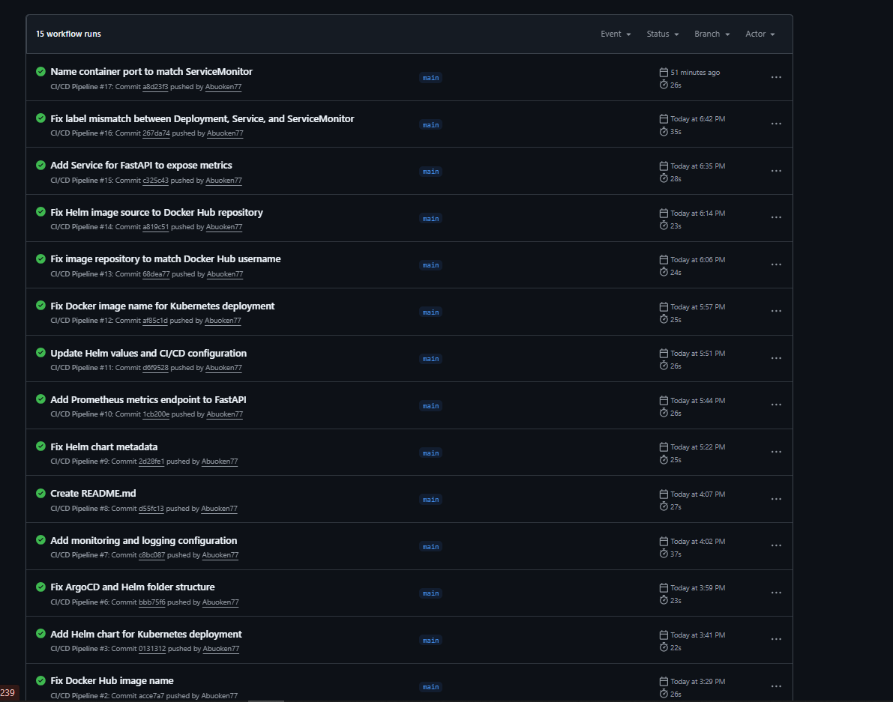
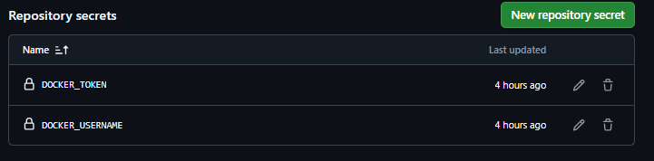
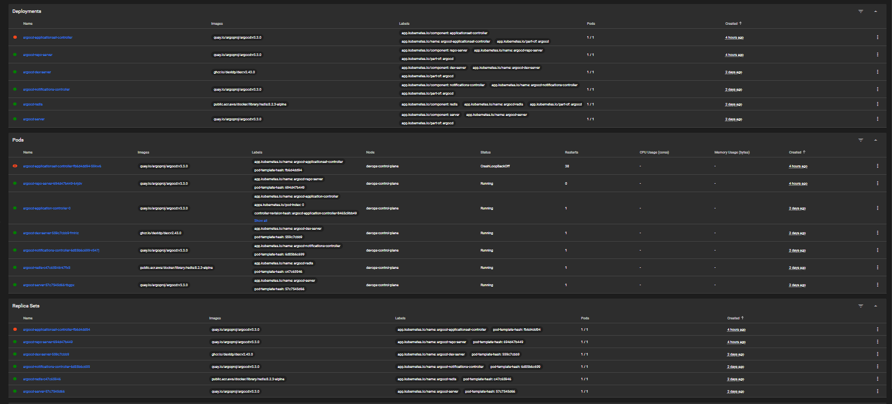
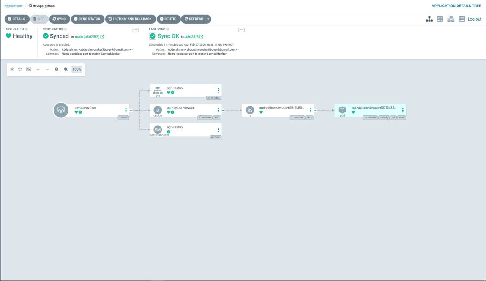
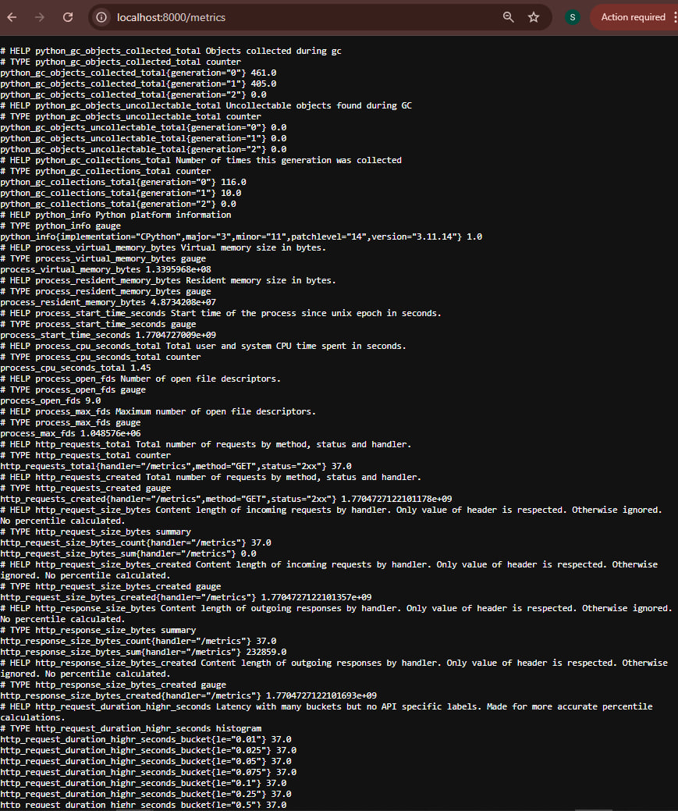
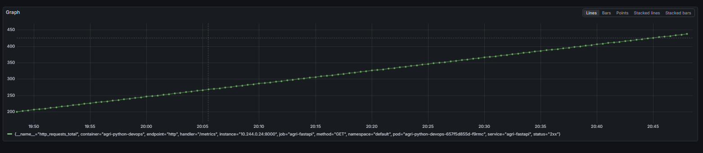
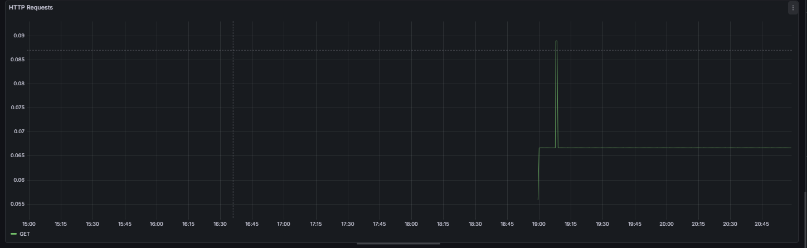
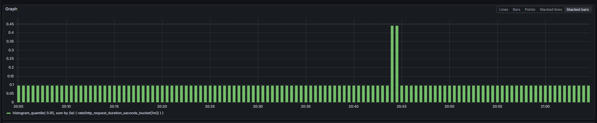
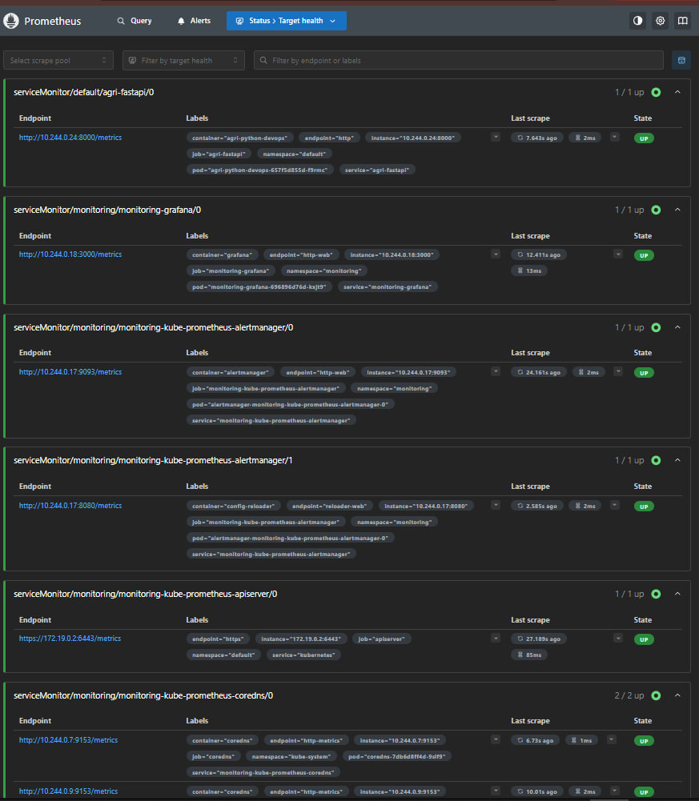
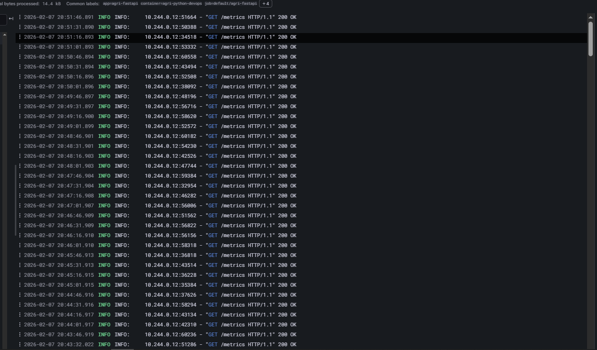

Alright. I’ll rewrite **your README** in a **clean, serious, academic style**, closely matching **your friend’s structure and tone**, but **100% aligned with what YOU actually built** (FastAPI, Helm, ArgoCD, Prometheus, Loki).
No Grafana datasource explanation, no extra fluff.

Below is a **ready-to-paste README.md**.

---

# DevOps Implementation for Agricultural Digital Platform (Python)

## Overview

This project demonstrates the implementation of modern **DevOps practices** for deploying, operating, and observing an agricultural digital platform.
The application is a **Python FastAPI service**, while the primary focus of the project is the **DevOps lifecycle** rather than application business logic.

The solution applies **CI/CD automation, containerisation, Kubernetes orchestration, GitOps with ArgoCD, monitoring, and logging** to ensure a reliable and observable system.

---

## Objectives

* Automate build and deployment using CI/CD
* Package the application using Docker
* Deploy and manage the application on Kubernetes
* Apply GitOps principles using ArgoCD
* Monitor application metrics using Prometheus
* Collect and analyse application logs using Loki

---

## Technology Stack

* **Version Control:** GitHub
* **CI/CD:** GitHub Actions
* **Containerisation:** Docker, Docker Hub
* **Orchestration:** Kubernetes (Docker Desktop)
* **Packaging:** Helm
* **GitOps:** ArgoCD
* **Monitoring:** Prometheus
* **Logging:** Loki
* **Application:** Python FastAPI

---

## CI/CD Pipeline

GitHub Actions is used to automate the build and delivery process.
On each push to the `main` branch, the pipeline performs the following steps:

1. Build the FastAPI application
2. Create a Docker image
3. Push the image to Docker Hub
4. Trigger ArgoCD auto-synchronisation

* GitHub Actions workflow runs (green / successful)

Below Repository secrets

---

## Kubernetes Deployment

The application is deployed to Kubernetes using **Helm charts**.
The Helm chart defines and manages the following resources:

* Deployment
* Service
* ServiceMonitor

The configuration ensures consistent deployments and supports future scalability.

* Kubernetes resources overview
* Helm-managed application structure (optional)
* The ArgoCD ApplicationSet controller is deployed as part of the standard ArgoCD installation. Although no ApplicationSet resources are defined in this project, the controller remains running and does not affect the deployment or operation of the application.

---

## GitOps with ArgoCD

ArgoCD continuously monitors the Git repository and synchronises the Kubernetes cluster with the desired state defined in Git.
Automated sync and self-healing are enabled to maintain system consistency.

* ArgoCD Application Tree showing:

  * Deployment
  * Service
  * ServiceMonitor
  * Pod (Healthy & Synced)

---

## Monitoring and Metrics

Prometheus is used to collect **system and application metrics** from the FastAPI service.

### Metrics Exposure

The FastAPI application exposes metrics via the `/metrics` endpoint, which is scraped by Prometheus using a **ServiceMonitor**.

* Browser view of `http://localhost:8000/metrics`
* Prometheus **Targets** page showing `agri-fastapi` target **UP**

### Observed Metrics

Monitored metrics include:

* HTTP request count
* Request latency
* Response status codes
* Python process and runtime metrics

* Prometheus query graph (HTTP requests over time)

 #### Shows live HTTP request volume handled by the FastAPI service.

#### Request Latency
The 95th percentile request duration is visualised to track API performance under load.

---
### Prometheus Target Health

Prometheus is configured to automatically discover and scrape metrics from Kubernetes services using **ServiceMonitor** resources.

The screenshot below shows the **Prometheus Targets** page, where all monitored endpoints are listed along with their current scrape status.

From this view, we can confirm that:

- The **FastAPI application** (`agri-fastapi`) is successfully exposing metrics on the `/metrics` endpoint
- Prometheus is actively scraping the application with a healthy **UP** status
- Core platform components such as:
  - Grafana
  - Alertmanager
  - Kubernetes API server
  - CoreDNS  
  are also being monitored
- Each target shows:
  - The scrape endpoint URL
  - Associated Kubernetes labels (namespace, pod, service)
  - Last scrape time and latency
  - Target health status (**UP**)

This confirms that the monitoring stack is correctly integrated with Kubernetes and that application and infrastructure metrics are reliably collected.

## Logging

Application logs are centrally collected using **Loki**.

Logs are streamed from the Kubernetes pods and can be queried and analysed in real time.
This enables efficient troubleshooting and visibility into application behaviour.

* Loki logs view showing FastAPI `/metrics` requests

---

## Conclusion

This project demonstrates how modern DevOps practices improve **automation, reliability, and observability** of digital platforms.
By combining CI/CD, Kubernetes, GitOps, monitoring, and logging, the solution provides a **stable and maintainable environment** suitable for real-world agricultural systems.

---

## Repository

GitHub repository:
👉 [https://github.com/Abuoken77/agri-python-devops](https://github.com/Abuoken77/agri-python-devops)
Owner Abuoken77
---

